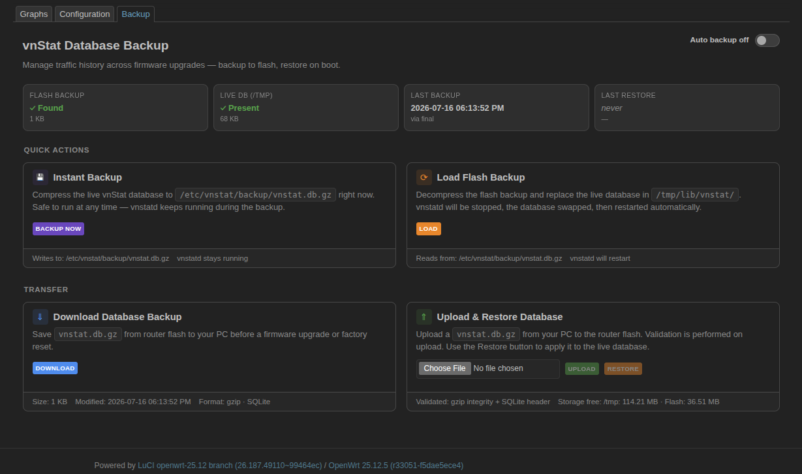

# LuCI Realtime Dashboard

Real-time system monitoring dashboard and vnStat database backup manager for OpenWrt. Renders live charts and stats inside the LuCI web UI. No external services or build tools required.

**Official upstream repository for the OpenWrt luci-app-dashboard package.**

---

## Quick Start

1) Install the package for your OpenWrt version (see Compatibility Matrix below).  
2) Restart service:

```bash
/etc/init.d/dashboard restart
```

3) Open LuCI page:

```
/cgi-bin/luci/admin/services/dashboard
```

---

## Installation

### For OpenWrt v25.12 or newer (.apk)

```bash
apk update && \wget --no-check-certificate -O /tmp/luci-app-dashboard.apk "https://github.com/OppsError404/luci-app-dashboard/releases/download/v2.0.0-r4/luci-app-dashboard-2.0.0-r4.apk" && \
apk add --allow-untrusted /tmp/luci-app-dashboard.apk && \
rm -f /tmp/luci-app-dashboard.apk
```

### For OpenWrt v24.10.5 or older (.ipk)

```bash
opkg update && \wget --no-check-certificate -O /tmp/luci-app-dashboard.ipk "https://github.com/OppsError404/luci-app-dashboard/releases/download/v2.0.0-r4/luci-app-dashboard_2.0.0-r4.ipk" && \
opkg install /tmp/luci-app-dashboard.ipk && \
rm -f /tmp/luci-app-dashboard.ipk
```

### Compatibility Matrix

| OpenWrt Version | Package Format | Installer |
|---|---|---|
| v25.12 or newer | `.apk` | `apk` |
| v24.10.5 or older | `.ipk` | `opkg` |

## Uninstallation

### For OpenWrt v25.12 or newer (.apk)

```bash
apk del luci-app-dashboard
```

### For OpenWrt v24.10.5 or older (.ipk)

```bash
opkg remove luci-app-dashboard
```

## Features

### Dashboard

- WAN RX/TX live rates with rolling chart
- Internet ping status and RTT
- PPPoE / DHCP / Static WAN detection and uptime
- Public IP, ISP name, ASN (12h cache)
- CPU usage — overall + per-core bars + line chart
- CPU and Wi-Fi chip temperatures
- RAM arc gauge, bar, and sparkline chart
- System uptime
- vnStat daily and monthly traffic totals (optional)
- Adblock domain count and status (optional)

### vnStat Backup

- Automated 12-hour scheduled backups to persistent flash storage
- Instant backup/restore via web UI or CLI
- Compressed gzip storage to minimize flash wear
- Persistent timestamp tracking across reboots
- Global CLI commands: `vnstat_backup` and `vnstat_restore`

---

## Usage

### Web Interface

Navigate to **Services → Dashboard** in the LuCI menu.

### Service Commands

```bash
/etc/init.d/dashboard status                  # Show full service status
/etc/init.d/dashboard vnstat_enable           # Enable vnStat card
/etc/init.d/dashboard vnstat_disable          # Disable vnStat card
/etc/init.d/dashboard adblock_enable          # Enable Adblock card
/etc/init.d/dashboard adblock_disable         # Disable Adblock card
/etc/init.d/dashboard vnstat_backup_enable    # Enable scheduled 12h DB backup
/etc/init.d/dashboard vnstat_backup_disable   # Final backup then disable
/etc/init.d/dashboard vnstat_backup_fix       # Repair missing cron job
/etc/init.d/dashboard vnstat_backup           # Immediate backup
/etc/init.d/dashboard vnstat_restore          # Immediate restore
```

### CLI Examples (Expected Outcome)

```bash
/etc/init.d/dashboard status
# Expected: dashboard service state + feature enable/disable status

/etc/init.d/dashboard vnstat_backup
# Expected: backup file created/updated under /etc/vnstat/backup/

/etc/init.d/dashboard vnstat_restore
# Expected: latest backup restored to vnStat DB location
```

### Global CLI Shims

```bash
vnstat_backup   # Same as /etc/init.d/dashboard vnstat_backup
vnstat_restore  # Same as /etc/init.d/dashboard vnstat_restore
```

---

## Configuration

Edit `/etc/config/dashboard`:

```
config dashboard 'settings'
    option vnstat   '1'     # Show vnStat traffic card (0/1)
    option adblock  '1'     # Show Adblock status card (0/1)
    option vnstat_db '0'    # Enable automatic vnStat DB backups (0/1)
    option multi_core '1'   # Manually enable/disable per-core graph (0/1)
```

Apply changes:

```bash
/etc/init.d/dashboard restart
```

### Feature Toggle Behavior

| Option | Value | Behavior |
|---|---|---|
| `vnstat` | `0` | vnStat traffic card is hidden |
| `adblock` | `0` | Adblock status card is hidden |
| `multi_core` | `0` | Per-core CPU graph is disabled (overall CPU still shown) |
| `vnstat_db` | `0` | Scheduled 12h vnStat backup is disabled |

If optional packages are not installed, related cards/features should be treated as unavailable.

---

## Dependencies

### Required

| Package | Required | Notes |
|---------|----------|-------|
| `luci-base` | Yes | LuCI framework |
| `lua` | Yes | Lua runtime |
| `luci-lib-nixio` | Yes | Nixio library for filesystem operations |
| `cgi-io` | Yes | CGI file upload helper |
| `libubus-lua` | Yes | ubus LuaAPI |
| `libuci-lua` | Yes | UCI configuration API |

### Optional

| Package | Required | Notes |
|---------|----------|-------|
| `vnstat2` | No | Enables traffic statistics |
| `adblock` | No | Enables adblock status card |

### Frontend (CDN)

- Chart.js 3.x
- Font Awesome 6.5

---

## URLs

```
/cgi-bin/luci/admin/services/dashboard
/cgi-bin/luci/admin/services/vnstat_backup
/cgi-bin/luci/admin/status/dashboard          (JSON API)
/cgi-bin/luci/admin/status/dashboard/force    (force cache clear)
```

---

## Notes

- vnstatd must be running for traffic stats to accumulate.
- vnStat DB backup requires vnstat2 to be installed and running.
- All cache files live in /tmp and reset on reboot.
- Backup files stored in /etc/vnstat/backup/ persist across reboots.

---

## Troubleshooting

- **Dashboard page opens but cards are blank**
  - Restart service: `/etc/init.d/dashboard restart`
  - Check API endpoint response: `/cgi-bin/luci/admin/status/dashboard`
- **No vnStat data shown**
  - Ensure `vnstat2` is installed and `vnstatd` is running.
  - Wait until traffic data accumulates.
- **Adblock card not visible or empty**
  - Ensure `adblock` package is installed.
  - Enable card: `/etc/init.d/dashboard adblock_enable`
- **Backup command fails**
  - Verify write access to `/etc/vnstat/backup/`
  - Ensure vnStat DB path exists and service is running.

---

## Migration Notes (v24 `.ipk` → v25 `.apk`)

1) Remove old package:

```bash
opkg remove luci-app-dashboard
```

2) Install new package format on newer OpenWrt:

```bash
apk add --allow-untrusted /tmp/luci-app-dashboard.apk
```

3) Restart service and verify LuCI URL:

```bash
/etc/init.d/dashboard restart
```

---

## Changelog

- **v2.0.0-r4**
  - Added OpenWrt split install path guidance (`apk` vs `opkg`)
  - Documented vnStat backup/restore commands and behavior
  - README structure improvements for faster setup

---

## Planned Roadmap (Top 5 Priorities)

1) API failure fallback messages (avoid blank cards)  
2) Auto-detect unavailable optional packages and show `Not Installed` state  
3) Backup/restore last result with clear error reason in UI  
4) User-configurable dashboard refresh interval  
5) Health-check JSON endpoint for monitoring integrations  

---

## Screenshots




---

### License

MIT License

---

## See Also
* [luci-app-client-monitor](https://github.com/OppsError404/luci-app-client-monitor) - Realtime per-client bandwidth usage and traffic monitor.
